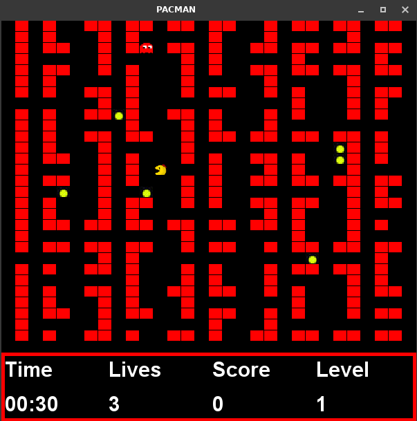

# Pac-Tastic!

Pac-Tastic is a Java Swing application that brings back the classic arcade game Pacman. 
It challenges players to navigate through a maze, eat pellets, avoid enemies, and collect various upgrades. 

## Table of Contents

- [Features](#features)
- [Installation](#installation)
  - [Linux MacOS](#linux-macos)
  - [Windows](#windows)
  - [Help Resources](#help-resources)
- [Usage](#usage)
- [Screenshots](#screenshots)
- [Contributing](#contributing)
- [License](#license)
- [Known Issues](#known-issues)
- [Donations](#donations)

## Features

- Main menu with options for starting a new game, viewing high scores, and exiting
- Real-time graphical interface with time, life, score and level counter
- Scalable, resizable game window 
- Randomly generated maze with customizable size (10 to 100 rows/columns)
- High score persistence in high-scores.dat
- Sound interactive gameplay

## Installation

### Linux MacOS

1. Ensure you have Java Development Kit (JDK) installed on your system and your path system variable has been set.
2. Clone the repository:
   ```bash
   git clone https://github.com/mikson022/pac-tastic.git
    ```
3. Get inside the repository and compile the source files:
    ```bash
    cd pac-tastic && javac -d bin -cp src src/*.java
    ```
4. Copy resources needed at runtime:
    ```bash
    cp -r resources/pics/ resources/sounds/ -t bin/
    ```
5. Run the program:
    ```bash
    cd bin && java Main
    ```

### Windows
1. Ensure you have Java Development Kit (JDK) installed on your system and your path system variable has been set.
2. Clone the repository:
   ```bash
   git clone https://github.com/mikson022/pac-tastic.git
    ```
3. Get inside the repository and compile the source files:
    ```bash
    cd pac-tastic
    javac -d bin -cp src src/*.java
    ```
4. Copy resources needed at runtime:
    ```bash
    xcopy /s /i resources\pics\* bin\ & xcopy /s /i resources\sounds\* bin\
    ```
5. Run the program:
    ```bash
    cd bin
    java Main
    ```
   
### Help Resources

If you're unable to install pac-tastic, make sure you have JDK and your path variable set up.
https://www.java.com/en/download/help/path.html

## Usage

- Navigate the main menu using the mouse and press to select an option.
- In the "New Game" option, enter the desired size of the game board (rows/columns).
- Control Pacman using the arrow keys.
- Points are generated in random places of the map every 5 seconds.
- When the game is over you can save the score.

## Screenshots





## Contributing

If you have any ideas, suggestions, or bug reports, please open an issue, submit a pull request or contact me directly.

## License

This project is licensed under the MIT License.

## Known Issues

- Rendering bugs cause some cells to 'blink'.
- When playing for a second time, map should be bigger than in previous game or program restarted.

## Donations
Monero - untraceable, private and decentralized.
  My Address:
```
88yBHqeAqXGN5edVUS299UFrk8r22xf4GT5isvFD4CY6KPP7PtLq9CDTCz8ctgbpzG4KG1CitbQr5PtovbrSpadQ5PP5AEa
```


